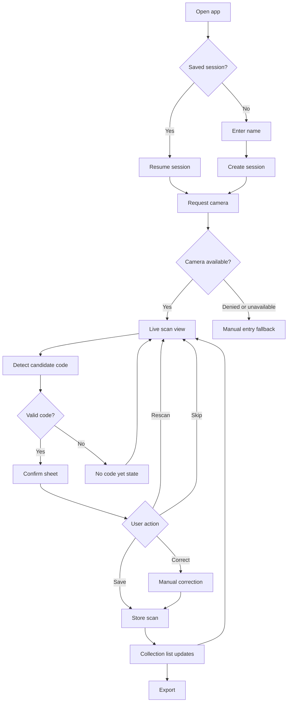
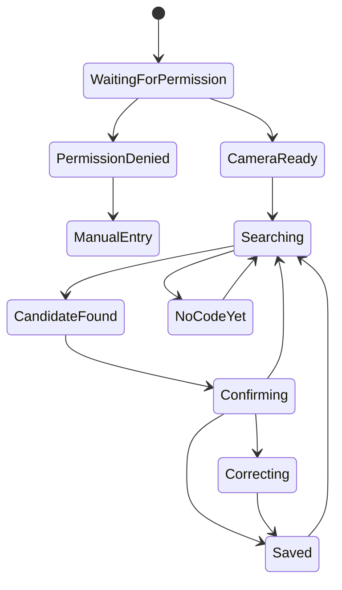
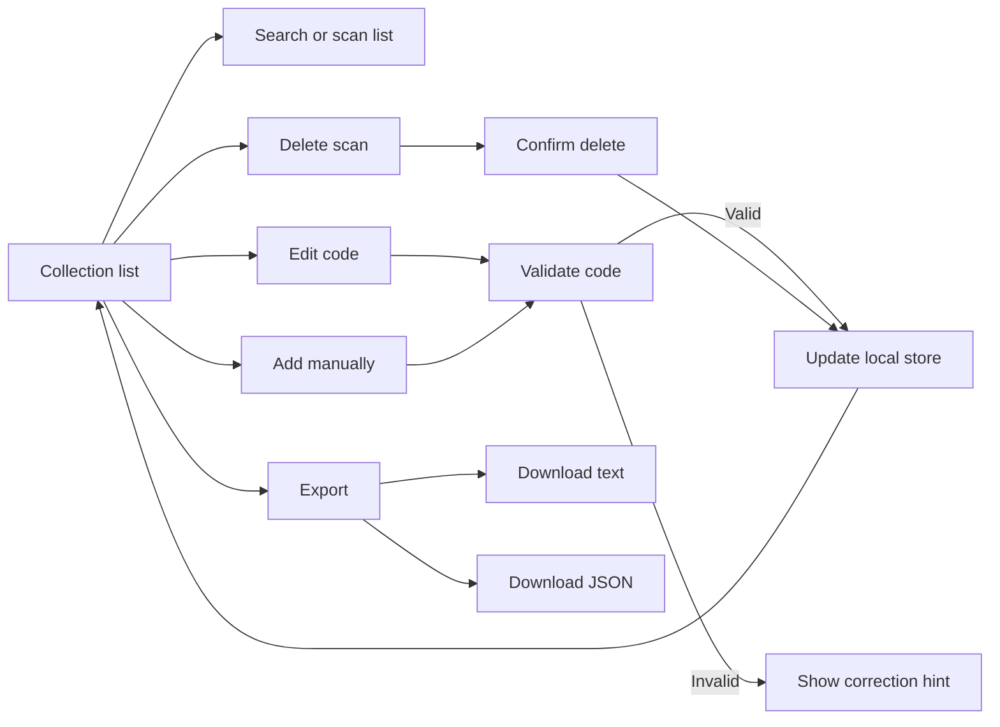

# Flows And User Stories

Status: draft v0.1  
Date: 2026-06-04

## Primary Flow

## Scan State Flow

## Collection Management Flow

## User Stories

### Session

As a collector, I want to enter my name and create a session so that my scans are grouped
under one collection.

Acceptance notes:

- Name is required.
- A saved local session can be resumed.
- Starting a new session does not silently delete the old one.

As a returning user, I want to resume my latest session so that I do not lose my list
after closing the browser.

Acceptance notes:

- The welcome screen shows the latest session summary.
- Resume is the primary action when a session exists.

### Camera And Permission

As a phone user, I want the app to ask for camera access clearly so that I understand why
the browser permission is needed.

Acceptance notes:

- The app explains camera use before or near the permission trigger.
- If access is blocked, the app offers manual entry.
- If no camera exists, the app still supports manual entry.

### Scanning

As a collector, I want a visible sticker target and top-right code box so that I know
where to place the sticker.

Acceptance notes:

- The scan target is visible over the camera preview.
- The ROI box is visually distinct from the rest of the target.
- Primary controls stay in the bottom third of the screen.

As a collector, I want the app to suggest a code only when it matches the known code
format so that nonsense OCR does not pollute my list.

Acceptance notes:

- Candidate codes are normalized to `<PREFIX><NN>`.
- Prefix must be known.
- Number must be 01 through 20.
- Invalid OCR text does not create a scan.

### Confirmation And Correction

As a user, I want to confirm or correct a detected code before saving so that OCR mistakes
are easy to catch.

Acceptance notes:

- The proposed normalized code is prominent.
- The captured image or crop is visible.
- Save, correct, rescan, and skip are available.
- Save is explicit.

As a kid collector, I want a simple correction screen so that I can fix one wrong digit
without typing a full code.

Acceptance notes:

- Prefix and number are visually separated.
- The current detected value pre-fills the correction form.
- The corrected value is validated before save.

### Collection

As a collector, I want to see every saved scan so that I can review my duplicate pile.

Acceptance notes:

- Each row shows code, time, source, and optional thumbnail.
- Duplicate counts are visible.
- Edit and delete are available per scan.

As a collector, I want to add a sticker manually so that the workflow keeps moving when
camera or OCR is unreliable.

Acceptance notes:

- Manual entries use the same validation as OCR entries.
- Manual entries are marked as manual in metadata.

### Export

As a swap organizer, I want to export a plain text list so that I can paste or share my
duplicates easily.

Acceptance notes:

- Text export includes metadata header and one normalized code per line.
- Counts by code are included.
- Export does not require an account.

As a family helper, I want JSON export with local evidence images so that I can preserve a
complete session backup.

Acceptance notes:

- JSON export includes metadata, scans, and image data URLs.
- The UI warns that JSON can be larger than text.

## Edge Cases To Design

- Permission denied or browser blocks camera after first approval.
- Camera available but OCR returns no valid code.
- Detected prefix is close but invalid, such as `AR6` instead of `ARG`.
- Number is outside range, such as `ARG21`.
- User scans the same sticker twice.
- User wants to delete an accidental save.
- User wants to continue with no network.
- User rotates the sticker or phone.
- User opens the app from a tablet or desktop.

## Non-MVP Flow Notes

Future sharing and matchmaking should begin from the export or collection summary, not
from the scan screen. The scan screen must remain focused on capture speed.
